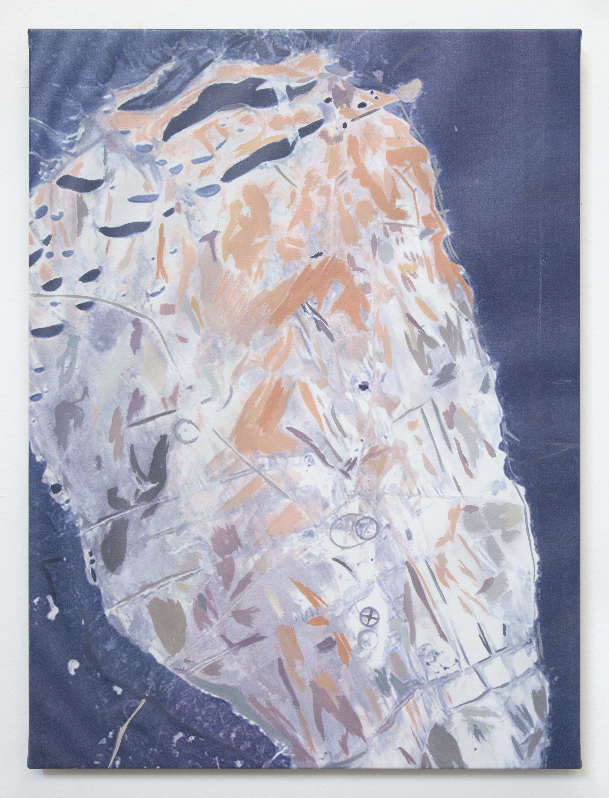

# The Tonopah Gap

The longest amount of time any area in the continental United States has gone without an update on Google Earth has been 8 years. From 2008 to 2016, a series of dry lake beds in Southwestern Nevada located in the Tonopah Test Range was a blind spot from the all-seeing corporate monolith continuously mapping the Earth.

After stumbling onto this strange piece of information, we, as researchers critical of the National Security State wanted to know how and why this happened. While the area has since been updated (the current image you see in Google Earth/Maps was taken on October 1st, 2017), the gap in Google Earth’s historical data set remains. (Since we began our investigation, Google Earth updated its historical dataset to include images from both 2014 and 2015, making the total gap remaining 6 years.)

That this gap occurred for eight years without any acknowledgement from Google, Alphabet, or the federal government suggests that it can happen again with no warning or oversight. This is Google’s Earth, not ours.

As we learned more about commercial satellite imagery, experimental military test sites, and the mechanics of Google Earth, we realized the only way to answer these questions was to find and purchase a satellite image of the “Tonopah Gap” ourselves.

Tonopah is a subsection of the Nellis Test and Training Range, which is jointly operated by the Department of Energy and Air Force. Since the early 1950s, the Nellis Range has been the site of extensive government aerospace and weapons testing. Many such dry lake beds on the site were historically used for aerial target practice. There are many such experimental weapons testing facilities around the US, but, strangely, none of the others have had such a long stretch of time without an update. We immediately assumed censorship at a federal level and began to wonder what, exactly, made this patch of Tonopah different.

The Tonopah Gap, which was recently, finally updated by Google. Image: Google Earth
We were interested in the mechanism used in the censorship. Was it a physical component of the satellite itself that prevented it from taking a photo? A direct order from the federal government to the satellite company that we could FOIA? Or something quieter, harder to track? So we began to research the history of commercial satellite imaging. In 1992, 32 years after the first classified US reconnaissance satellite was placed in orbit, the US Land Remote Sensing Policy Act made it legal for commercial satellite imagery vendors to sell to civilian entities. The politics of this were, and remain, a compromise between the two predominant neoliberal concerns of national security and capital. If anyone could purchase satellite images, a certain tactical advantage would be lost by US military/security forces.

However, as former CIA Senior Executive Intelligence Officer Michele Brunngraber wrote in a paper for the National War College [pdf], "the argument was that it would be better to have U.S. contractors dominate the industry," where the industry-standard resolution and other points of concern could be regulated by federal law. Still, the tension between the concerns of capital and national security continues to the present day. In 2016 Walter Scott, the founder of DigitalGlobe, an industry-leading commercial satellite imagery vendor, pleaded for the unleashing of the “power of the U.S. commercial remote sensing industry.

This close relationship between the private sector and the government allows the federal government to censor satellite imagery officially and unofficially. The official censorship method is known as "Formal Interruption of Normal Commercial Operations," also known as "Modified Operations" or "Shutter Control” [pdf]. This occurs when the National Geospatial-Intelligence Agency (NGA), the Department of the Navy, the Department of Commerce, or another government agency invokes national security and declares the sale of certain imagery as off-limits for the commercial satellite imagery market or demands commercial satellite image resellers/providers reduce the image resolution of said imagery. Shutter control proved highly controversial as a concept, at least until 9/11 occurred and First Amendment rights began to be routinely sacrificed en masse for nebulous security gains.

But shutter control has never been officially invoked. Bureaucracy may have something to do with this, as the Secretary of State, Commerce, or Defense would have to sign such an order personally. Instead, the federal agency in question practices what is known as "checkbook shutter control" or "buy-to-deny," purchasing the exclusive rights to imagery from commercial satellite vendors and then sitting on said rights. According to various media sources, buy-to-deny was used in conjunction with US operations in Afghanistan in 2001 and 2002. An NGA spokesperson, however, told us in an email that there is no such policy and that "given the number of vendors and capabilities in the current commercial remote sensing marketplace, it would not be practical nor effective to take this approach." This year, Walter Scott confirmed to Wired that there is an "exclusivity arrangement" between DigitalGlobe and "US government customers."
To determine if either shutter control or buy-to-deny had been used to censor Tonopah, we obtained a series of satellite images from Apollo Mapping—a reseller of commercial satellite imagery which works closely with DigitalGlobe—of our dry lake beds (two of which have names we have been able to verify: Antelope Lake and Main Lake.). We were able to identify at least 8 images (from 2009, 2011, 2013, and 2014) which would have fulfilled Google Earth's apparent needs (i.e. color, decent coverage, high-resolution, no cloud cover). This does not, of course, prove that the federal government did not engage in any censorship of images of the dry lake beds in Tonopah. It merely proves that there was a substantial set of images Google Earth could have used to fill its gap.

At this point, we found it necessary to figure out how, exactly, Google Earth works. Basically, Google Earth is a mosaic of tiles assembled from aerial and satellite photos. The former are often provided by local and federal government as well as Google itself; these bodies tend to be well supplied with fleets of aerial vehicles. Satellite photos, especially useful in cases where state and semi-state actors don't want aircraft flying over certain terrain, are purchased by Google from various vendors, including the Centre national d'études spatiales, the Korea Aerospace Research Institute, Terra Bella, and DigitalGlobe. As Trevor Paglen writes in his 2009 NatSec road trip Blank Spots on the Map: The Dark Geography of the Pentagon's Secret World, Nellis is covered by a "twelve thousand square-mile swath of military airspace." As a result, Google Earth defaults to satellite imagery over Tonopah.

Images are then stitched together. As of 2009, according to the Google Earth Blog (an excellent, volunteer-run collaboration not affiliated with Google Earth or Alphabet), updates occurred once about once every 60 days, on average. By 2014, according to an updated version of the above blogpost, that time was cut in half. Related Google Earth Blog analysis by Timothy Whitehead in 2012 showed that Google Earth was covering the whole of the United States "roughly every three years," save for "just one little area in Nevada that seems to have been missed," by which Whitehead meant our dry lake beds, although he apparently didn’t make the connection they were on a military testing ground. This makes the 8 years this section of Tonopah went without an update an extreme outlier.

(For DIY enthusiasts: we learned the Tonopah gap was discovered by inserting a KML file generated by Google Earth Blog into a downloaded version of Google Earth. KML stands for Keyhole Markup Language, a file format used for storing geographic data. The KML file drew boxes over Google Earth's updated imagery from June 1997 to June 2016 and came up with this particular image as lacking an update. If you would like to see the original KML files, they currently live on Dhruv’s server. If you want to independently verify this using Google Earth Pro, check in these coordinates: 37°41'6.39"N 116°39'57.31"W and click on the icon for historical imagery. Note: you need Google Earth Pro to access these.)

The Nellis Complex contains the drone pilot HQ Creech Air Force Base, the site of extensive nuclear detonations formerly known as the Nevada Proving Grounds, and what is colloquially referred to as Area 51. The F-117A Nighthawk stealth fighter, experimental unpersoned aerial vehicles, and, most recently, the delivery vehicle of the much-thunkpieced B61-12, a "steerable," variable yield nuclear bomb, have been tested there. This made Tonopah a deeply unlikely place to be coincidentally left off a map anyone with access to Google could survey.

Shutter control and its checkbook variation off the table, we decided that the censorship must be either via backdoor communique or existing, ongoing agreement. Or Google must have decided, of its own accord, to self-censor.

With a grant from the Polyfill Foundation and support from Eyebeam, we were able to acquire one of the images of the dry lakebed from Apollo (#103001000EBC3C00, taken on 1/6/2013 by a satellite known as WorldView2) for the academic price of $1,984.50. Our initial intention was to obtain an exclusive copyright of the image, then sell it to Google Earth at the price of $1 for inclusion in its historical map set. As a result, instead of an 8-year gap there would merely be a pair of four-year gaps. And, perhaps, Google might then answer our question as to why the gap was allowed to exist in the first place.

However, upon receiving the Apollo Mapping contract, we discovered that an exclusive copyright was not on offer, merely a lease. Mark Bradford, a lawyer who specializes in copyright and media, advised us that the contract's internal contradictions would open the way for a take-down notice and a lawsuit. This is why the illustration for this article is not the leased image #103001000EBC3C00, but rather a painting of said image by the LA- based artist Sebastian Gladstone. We contracted Gladstone, via Eyebeam, to create a series of paintings of the image in an attempt to explore the nature of copyright as it affects artists, national security, and the public good. We, a pair of non-specialists, don’t know whether image #103001000EBC3C00 shows anything of national security importance (and no one was forthcoming with information about this.) For us, its meaning is solely bound up in its lack of availability and in the various structures of state and corporate power which were leveraged to keep us from showing it to you.

Google did not respond to multiple requests for comment about why the Tonopah Gap exists. [Update: After this article was published, a Google spokesperson told Motherboard the following: “Google Earth didn’t censor this area in Nevada. Our satellite imagery is licensed from third party providers which are commercially available and are not the property of Google. We update imagery by prioritizing areas that are most popular with users while complying with local and federal laws.”]

So we are ending this piece by asking Google directly: why?

Why did you allow the coverage of an experimental military base on US soil to lapse on your mapping platform for eight years? Do you have a tacit agreement with the US government to keep this area off of Google Maps? Do you merely think that Don't Be Evil means Only Spy on Civilians? Please tell us, Google, we'd love to know.

Unfortunately, we don't expect Google to answer us. Which is why we would like to you, the reader, to join us at Eyebeam, at 199 Cook Street in Brooklyn, at 6pm on Thursday October 25th to view image #103001000EBC3C00 yourself. The contract we signed with Apollo states that we may show "image derivatives" of image #103001000EBC3C00 to "authorized users" within our company. Thus all attendees will have to sign a document temporarily making them independent contractors of Eyebeam. This event, entitled "Internal Use Only," will also feature Gladstone's paintings, a performance of original poetry by Marvin Mayfield, and conversations with Bradford and Sharon Weinberger, the DC bureau chief for Yahoo News.

Instead of being a flat, endless digital plain, as various cyberlibertarian progenitors would like us to believe, the internet is riddled with lacuna. We believe we have an all-seeing eye just a click away on our various screens. Instead, we have unprecedented access to a false earth. We ask you to join us in rejecting this false earth and working toward new ways of seeing.

(Oh, and if you work for Google/Alphabet and are in Bushwick on the 25th, please feel free to stop by as well...)

